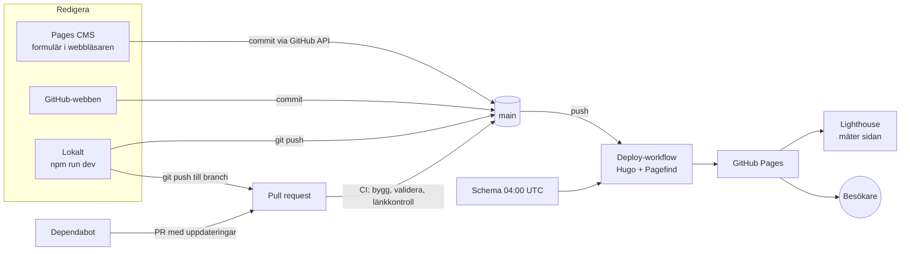
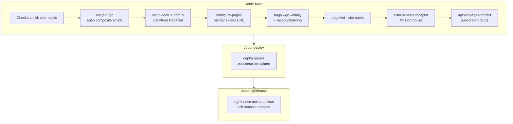
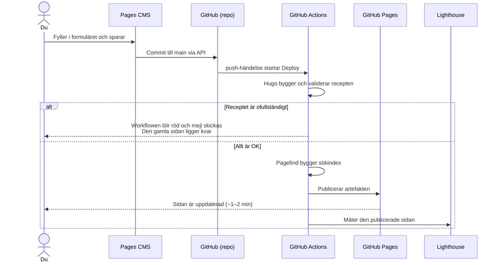

# eatit – teknisk beskrivning

Så här är eatit byggt: vilka tekniker som används, hur de hänger ihop och vad som händer i GitHub när något ändras. Varför saker blev som de blev står i [SPEC.md](SPEC.md). Hur man lägger in recept står i [README.md](README.md).

Senast uppdaterad 2026-09-30.

---

## 1. Översikt

eatit är en **statisk webbplats** för recept. Det finns ingen server, ingen databas och ingen inloggning på själva sidan. Recepten är textfiler (Markdown) i ett git-repo. Vid varje ändring bygger **Hugo** om hela sidan till färdiga HTML-filer, som **GitHub Pages** sedan serverar.

- **Sidan:** https://andreasgoude.github.io/eatit/
- **Repo:** https://github.com/andreasgoude/eatit (publikt, vilket krävs för gratis GitHub Pages)
- **Kostnad:** 0 kr. Allt körs på gratisnivåer.



---

## 2. Teknikstack

| Del | Teknik | Version | Roll |
|---|---|---|---|
| Sidgenerator | [Hugo](https://gohugo.io) Extended | 0.167.0 | Gör om Markdown och mallar till HTML, bearbetar bilder, buntar JS |
| Theme | [Congo](https://github.com/jpanther/congo) | v2.14 (git submodule) | Grundlayout, typografi, färgschema, mörkt läge, svenska texter |
| CSS | Tailwind (förkompilerad i Congo) och egen CSS | – | Congo har färdig CSS, så Tailwind behöver inte byggas. Vår egen CSS ligger i `assets/css/custom.css` |
| Sök | [Pagefind](https://pagefind.app) | 1.5.2 (npm) | Bygger ett statiskt sökindex efter Hugo. Sökningen körs helt i webbläsaren |
| Portionsskalning | Vanlig JavaScript | – | `assets/js/servings.js`, buntad och minifierad av Hugo (esbuild) |
| Strukturerad data | schema.org/Recipe (JSON-LD) | – | Gör att Google kan visa recepten som rika resultat |
| Innehållsredigering | [Pages CMS](https://pagescms.org) | hostad tjänst | Formulär ovanpå GitHub, styrs av `.pages.yml` |
| Hosting | GitHub Pages | – | Serverar de byggda filerna över HTTPS |
| CI/CD | GitHub Actions | – | Bygger, testar, publicerar och mäter |
| Beroendeuppdatering | Dependabot | – | Veckovisa PR:er för actions, tema och Pagefind |
| Länkkontroll | [lychee](https://github.com/lycheeverse/lychee) | action v2 | Hittar trasiga interna länkar i CI |
| Prestandamätning | [Lighthouse CI](https://github.com/treosh/lighthouse-ci-action) | action v12 | Mäter prestanda, tillgänglighet, bästa praxis och SEO efter deploy |
| Node.js | LTS | – | Används **bara** för att köra Pagefind. Sidan i sig har inget Node-bygge |

---

## 3. Repots struktur

```
eatit/
├── hugo.toml                  Hugo-konfiguration: URL, språk, theme, Congo-inställningar, meny
├── content/
│   ├── _index.md              Startsidans välkomsttext
│   └── recipes/
│       ├── _index.md          Rubrik för listan "Alla recept"
│       └── <slug>/index.md    Ett recept = en mapp ("page bundle")
├── archetypes/recipes.md      Mall för nya recept (hugo new recipes/x/index.md)
├── assets/
│   ├── css/custom.css         Egen CSS: färgvariabler, rutnät, kort och receptsida
│   ├── js/servings.js         Portionsskalning
│   └── images/                Bilder uppladdade via Pages CMS
├── layouts/                   Egna mallar. De går före temats mallar
│   ├── index.html             Startsidan
│   ├── term.html              Lista för en kategori eller tagg
│   ├── recipes/
│   │   ├── single.html        Receptsidan
│   │   └── list.html          Listan "Alla recept"
│   └── _partials/             Återanvändbara delar (kort, sök, JSON-LD, validering …)
├── themes/congo/              Theme, som git submodule (pekar på en exakt commit)
├── .pages.yml                 Formulärdefinition för Pages CMS
├── package.json               Pagefind och npm-skripten dev och build
├── .github/
│   ├── workflows/deploy.yml   Bygg och publicera (vid push, schema och manuellt)
│   ├── workflows/ci.yml       Kontroll av pull requests
│   ├── actions/setup-hugo/    Egen composite action som installerar Hugo
│   ├── dependabot.yml         Automatiska uppdateringar
│   └── lighthouserc.json      Tröskelvärden för Lighthouse
├── SPEC.md                    Krav, plan och beslut
├── TEKNIK.md                  Det här dokumentet
└── README.md                  Snabbstart och hur man lägger in recept
```

**Genereras och committas inte** (se `.gitignore`): `public/` (den byggda sidan), `resources/_gen/` (Hugos cache för bearbetade bilder), `node_modules/` och `static/pagefind/` (sökindex för lokal utveckling).

---

## 4. Innehållsmodell

### Ett recept

Ett recept är en Markdown-fil med **front matter** (YAML) överst och instruktionerna som vanlig Markdown under:

```yaml
---
title: Tonfiskbiffar
date: 2026-09-30
draft: false
description: Bästa som finns i sjön
image: /images/screenshot-2026-09-30-at-123326.png
categories: [Middag, Lunch]
tags: [snabbt]
servings: 4
prepTime: 15        # minuter
cookTime: 30
totalTime: 45
difficulty: medel   # enkel | medel | svår
ingredients: |-
  3 dl kallt kokt ris
  2 burkar tonfisk i olja
  Till servering:
  lime
---
Blanda ihop allt och stek i olja.
```

| Fält | Obligatoriskt | Används till |
|---|---|---|
| `title` | ja | Rubrik, sökning, kortet och JSON-LD |
| `categories` | ja | Filter i sökningen, kategorisidor och `recipeCategory` |
| `ingredients` | ja (minst en) | Ingredienslistan, portionsskalning och `recipeIngredient`. Flerradig text med en ingrediens per rad. En äldre YAML-lista fungerar också |
| `servings` | ja (> 0) | Portionsväljaren och `recipeYield` |
| `difficulty` | nej, men måste vara giltigt om det anges | Visas på kort och receptsida |
| `image` | nej, men filen måste finnas om det anges | Kort, receptsida, sökträffar och JSON-LD |
| `date` | nej | Sortering. Ett framtida datum gör att receptet publiceras först den dagen |
| `draft` | nej | `true` döljer receptet på den publicerade sidan (syns lokalt med `-D`) |
| `prepTime`, `cookTime`, `totalTime` | nej | Tider i minuter. Visas som t.ex. "1 h 30 min" och som `PT90M` i JSON-LD |

Vilka fält som är obligatoriska styrs av `layouts/_partials/validate-recipe.html` (se 5.4).

### Ingredienser: från text till rader

Ingredienserna lagras som **en flerradig text** (YAML `|-`), så att man kan klistra in en hel lista i Pages CMS. `layouts/_partials/recipe-ingredients.html` gör om texten till rader, och alla andra delar (receptsidan, JSON-LD och valideringen) använder den partialen:

1. Texten delas upp på radbrytningar (en rad per retur).
2. En punkt i början av raden (`-`, `*`, `•`, `·`, `–` …) tas bort, och raden trimmas.
3. Tomma rader hoppas över.
4. En rad som slutar med `:` och har högst 40 tecken blir en **underrubrik**, t.ex. "Fyllning:". Underrubriker visas som små versaler, skalas inte av portionsväljaren och räknas inte som ingredienser i JSON-LD eller i valideringen.

Om fältet i stället är en YAML-lista (det äldre formatet) används listan som den är.

### Bilder: två platser

Bilder kan ligga på två ställen, och mallarna letar på båda (`recipe-image-resource.html`):

1. **I receptets mapp**, t.ex. `content/recipes/kanelbullar/cover.jpg` med `image: cover.jpg`. Det är Hugos "page bundle"-modell.
2. **I `assets/images/`**, med `image: /images/fil.jpg`. Det är dit Pages CMS laddar upp, eftersom den har en gemensam mediamapp.

I båda fallen läser Hugo originalbilden och skapar beskurna WebP-versioner i rätt storlek: 480×320 för kort, 1200×700 för receptsidan, 300×200 för sökträffar och 1200×900 för Google. Originalet laddas aldrig ner av besökarna.

---

## 5. Hur sidan byggs

### 5.1 Hugo och mallarna

Hugo läser `hugo.toml`, går igenom allt i `content/` och renderar varje sida med en mall. Mallar letas upp i en fast ordning, och **projektets `layouts/` går alltid före temats**. Därför kan vi ha egna mallar för allt som rör recept, medan Congo står för resten: sidhuvud, sidfot, `<head>`, typsnitt, kategoriöversikten och 404-sidan.

| Sida | Mall | Innehåll |
|---|---|---|
| Startsidan `/` | `layouts/index.html` → `recipe-home.html` | Välkomsttext, Pagefind-sök, kategorichips och ett rutnät med alla publicerade recept |
| `/recipes/` | `layouts/recipes/list.html` | Rutnät med alla recept |
| `/categories/middag/` m.fl. | `layouts/term.html` | Rutnät med recepten i kategorin eller taggen |
| `/recipes/<slug>/` | `layouts/recipes/single.html` | Validering, bild, tider, chips, ingredienser med portionsväljare, instruktioner, datum och redigeringslänk |
| `/categories/`, 404 m.m. | Congo | Temats egna mallar |

Congo har en **krok**, `_partials/extend-head.html`, som vi använder för att lägga JSON-LD i `<head>` på receptsidor.

### 5.2 CSS, färger och mörkt läge

- Congo levererar en **förkompilerad Tailwind-CSS**, så inget CSS-bygge behövs. Congo läser automatiskt in `assets/css/custom.css` efter sin egen CSS.
- Vår CSS använder bara egna variabler (`--r-text`, `--r-muted`, `--r-card`, `--r-accent` …). Överst i filen mappas de mot Congos färgschema (`--color-neutral-*`, `--color-primary-*`). Byter man `colorScheme` i `hugo.toml` (t.ex. till `ocean`) följer receptdelen med automatiskt.
- **Mörkt läge:** Congos `appearance.js` sätter klassen `dark` på `<html>` om besökarens system är inställt på mörkt, eller om besökaren har valt mörkt med knappen i sidfoten. Valet sparas i webbläsarens `localStorage`. Vår CSS har ett `html.dark { … }`-block som byter värdena på variablerna.
- Instruktionstexten får Congos typografi via Tailwind-klasserna `prose dark:prose-invert`. De sätts med `proseClass` i `hugo.toml`.
- Det finns en utskrifts-CSS som döljer meny, sök och portionsväljare när man skriver ut ett recept.

### 5.3 JavaScript

Sidan fungerar utan JavaScript, med undantag för sök och portionsskalning:

| Skript | Källa | Vad det gör |
|---|---|---|
| `appearance.js` | Congo | Ljust/mörkt läge |
| `servings.js` | Vårt. Hugo buntar och minifierar det med `js.Build` (esbuild), och filnamnet får ett hash-fingeravtryck | Hoppar över underrubriker och läser den inledande mängden på varje ingrediensrad ("3dl", "1-2", "½", "ca 13 dl") och skalar den med faktorn nya/ursprungliga portioner. Avrundar till närmaste kvart och visar ¼ ½ ¾. Text längre in på raden, t.ex. "(400 g)", ändras inte |
| `pagefind-ui.js` | Pagefind | Laddas bara på startsidan. Sökgränssnittet hämtar små bitar av indexet vid behov |

### 5.4 Receptvalidering

`validate-recipe.html` anropas överst i receptmallen och stoppar bygget med `errorf` om ett recept är ofullständigt:

```
ERROR Receptet recipes/trasig/index.md saknar ingredients
ERROR Receptet recipes/trasig/index.md har okänd difficulty "lätt" (enkel, medel eller svår)
ERROR Receptet recipes/trasig/index.md: bilden "/images/x.jpg" hittades varken i receptets mapp eller i assets/
```

Eftersom kontrollen är en del av själva Hugo-bygget körs den **överallt**: i `hugo server` lokalt (felet visas i webbläsaren), i CI för pull requests och vid deploy. Misslyckas bygget vid deploy publiceras ingenting, och **den förra versionen av sidan ligger kvar**. Utkast (`draft: true`) valideras inte i produktion, eftersom de inte renderas.

### 5.5 Sökindex (Pagefind)

Efter Hugo körs `pagefind --site public`. Pagefind läser de färdiga HTML-filerna och skriver ett index till `public/pagefind/`.

- Bara element med `data-pagefind-body` indexeras, och det attributet har bara receptsidans `<article>`. Därför blir sökträffarna alltid recept och aldrig listor eller startsidan.
- `data-pagefind-filter="Kategori"` på kategorichipsen gör dem till klickbara filter i sökningen.
- `data-pagefind-meta="image:…"` ger sökträffen en liten bild.
- Delar som inte ska sökas, som portionsväljaren och sidfoten, har `data-pagefind-ignore`.
- Språket läses från `<html lang="sv-SE">`, vilket ger svensk ordstamning.

Hela indexet består av statiska filer. Ingen sökserver behövs.

### 5.6 Byggkommandon

| Var | Kommando | Resultat |
|---|---|---|
| Lokalt, utveckling | `npm run dev` | Bygger, skapar sökindex i `static/pagefind/` och startar `hugo server -D` på http://localhost:1313/eatit/ med live reload |
| Lokalt, utan sök | `hugo server -D` | Snabbast, men sökningen visar inga träffar |
| Lokalt, produktion | `npm run build` | `public/` med sökindex, som i Actions |
| CI | `hugo --gc --minify --panicOnWarning` | Som produktion, men varningar räknas som fel |
| Deploy | `hugo --gc --minify --baseURL <Pages-URL>` och `pagefind` | Det som publiceras |

---

## 6. Redigeringsflöden

### 6.1 Pages CMS (vardagsflödet)

1. Man loggar in på app.pagescms.org med GitHub. Pages CMS har bara behörighet till de repon man har gett den åtkomst till.
2. Pages CMS läser `.pages.yml` från repot och bygger ett formulär: textfält, datumväljare, kategoriväljare, en lista för taggar, en textruta där hela ingredienslistan klistras in, bilduppladdning och en textredigerare som sparar Markdown.
3. Nya recept sparas som `content/recipes/<slug>/index.md`. Sluggen skapas från titeln, t.ex. "Röd linssoppa" → `rod-linssoppa`, och filnamnsfältet är dolt så att mappstrukturen alltid blir rätt.
4. **Varje sparning blir en commit direkt till `main`** via GitHubs API, t.ex. *"Create content/recipes/tonfiskbiffar/index.md (via Pages CMS)"*. Det startar deploy-workflowen.
5. Bilder laddas upp till `assets/images/` som en egen commit.

**Begränsning:** Pages CMS skickar bilden via sin egen server, kodad som text. Stora mobilfoton ger felet **413 (Payload Too Large)**. Lösningen är att välja storleken *Medel* i iPhones bildväljare, eller att ladda upp bilden via GitHub och sedan välja den i Pages CMS mediabibliotek.

### 6.2 GitHub-webben

Man redigerar eller skapar filer direkt på github.com. Länken "Redigera på GitHub" på varje receptsida går direkt till rätt fil. Det blir en commit till `main`, precis som från Pages CMS.

### 6.3 Lokalt

```bash
git clone --recurse-submodules https://github.com/andreasgoude/eatit.git
cd eatit && npm install
hugo new recipes/mitt-recept/index.md
npm run dev
```

Större ändringar görs på en branch och går via en pull request, så att CI kontrollerar dem innan merge.

---

## 7. Det som händer i GitHub

### 7.1 Inställningar i repot

| Inställning | Värde | Varför |
|---|---|---|
| Synlighet | Publik | Gratis GitHub Pages och obegränsade Actions-minuter |
| Pages → Source | **GitHub Actions** | Sidan publiceras från en workflow-artefakt, inte från en branch |
| Ruleset på `main` | Kräver att CI-checken `check` är grön. **Repository admin** får kringgå regeln | PR:er (t.ex. från Dependabot) kan inte mergas med röd CI. Admin-undantaget gör att Pages CMS och snabba webbändringar kan gå direkt till `main` |
| Secrets | Inga | Allt använder den automatiska `GITHUB_TOKEN` och OIDC |

### 7.2 Deploy-workflow (`.github/workflows/deploy.yml`)

**Startas av:**
- `push` till `main`: varje commit, från Pages CMS, GitHub-webben, en merge eller en push.
- `schedule`, varje dag 04:00 UTC: publicerar recept med ett framtida datum när dagen kommer.
- `workflow_dispatch`: manuellt via knappen *Run workflow* under Actions.



Detaljer:
- **Behörigheter:** `contents: read`, `pages: write` och `id-token: write`. `id-token` gör att `deploy-pages` kan visa för GitHub Pages med en kortlivad OIDC-token att det är just den här workflowen som publicerar, utan lagrade lösenord.
- **`concurrency: pages`:** bara en deploy åt gången. En pågående deploy avbryts inte.
- **Environment `github-pages`:** varje deploy syns under *Deployments* i repot, med länk till sidan.
- **Lighthouse-jobbet** körs efter att sidan är publicerad och testar den riktiga URL:en. Trösklarna i `lighthouserc.json` är satta till *warn*: 0,8 för prestanda och 0,9 för övriga kategorier. Rapporten laddas upp som artefakt och som en tillfällig publik länk i jobbets logg. Om jobbet blir rött är sidan ändå redan publicerad.
- **Tid:** cirka 1–2 minuter från commit till live.

### 7.3 CI-workflow (`.github/workflows/ci.yml`)

**Startas av:** varje pull request, och manuellt.

1. Checkout, Hugo och Pagefind (samma setup som vid deploy).
2. **Strikt bygge** med `--panicOnWarning`. Fångar trasiga mallar, ofullständiga recept och Hugo-funktioner som håller på att fasas ut.
3. **Sökindex** med Pagefind, för att se att det fungerar.
4. **Länkkontroll** med lychee: `public/` kopieras till `_linkcheck/eatit/`, så att sökvägar som `/eatit/recipes/…` motsvarar riktiga filer. Sedan kontrolleras alla interna länkar, bilder, CSS och JS. Externa länkar hoppas över (`--offline`), så att CI inte blir röd när en annan sajt ligger nere.
5. **Sammanfattning** i jobbets *Summary*: antal recept, utkast och HTML-sidor.

`concurrency` med `cancel-in-progress` avbryter en gammal körning när man pushar nya ändringar till samma PR. Checken heter **`check`**, och det är den som rulesetet kräver.

### 7.4 Composite action (`.github/actions/setup-hugo`)

Ett eget litet återanvändbart steg som laddar ner Hugo Extended som `.deb` från Hugos GitHub-releaser och installerar det. Både deploy och CI använder det, så **Hugo-versionen anges bara på ett ställe** (`inputs.version`, just nu `0.167.0`).

### 7.5 Dependabot (`.github/dependabot.yml`)

Letar en gång i veckan efter nya versioner och öppnar PR:er, som CI sedan kontrollerar:

| Ekosystem | Vad som uppdateras |
|---|---|
| `github-actions` | Alla `uses:` i workflows och i vår composite action, grupperade i en PR |
| `gitsubmodule` | Congo-temat: flyttar submodulen till senaste commit |
| `npm` | Pagefind |

Hugo-versionen i `setup-hugo` uppdateras **inte** av Dependabot. Den ändras för hand.

### 7.6 Ett helt flöde: spara ett recept i Pages CMS



### 7.7 Var varje kontroll körs

| Kontroll | Lokalt (`hugo server`) | Pull request (CI) | Deploy |
|---|---|---|---|
| Hugo-bygget lyckas | ✅ | ✅ | ✅ |
| Receptvalidering | ✅ | ✅ | ✅ |
| Varningar räknas som fel | – | ✅ | – |
| Sökindex byggs | med `npm run dev` | ✅ | ✅ |
| Interna länkar | – | ✅ | – |
| Lighthouse | – | – | ✅ (efter publicering, varnar bara) |

---

## 8. Versioner: var de låses och hur de uppdateras

| Vad | Var | Uppdateras av |
|---|---|---|
| Hugo | `.github/actions/setup-hugo/action.yml` (`0.167.0`) och lokalt via Homebrew | För hand |
| Congo | Submodulens commit (`themes/congo`) | Dependabot |
| Pagefind | `package.json` och `package-lock.json` | Dependabot |
| Actions | Major-taggar i workflowsen (`@v7`, `@v5` …) | Dependabot |
| Node | `lts/*` i workflowsen | Automatiskt (senaste LTS) |

Lokalt bör man köra samma Hugo-version som i Actions (`hugo version`), annars kan varningar dyka upp först i CI.

---

## 9. Gratisnivåer och gränser

| Tjänst | Gräns | Påverkan på eatit |
|---|---|---|
| GitHub Pages | Sidan högst 1 GB, ungefär 100 GB trafik i månaden (mjuk gräns) | Långt under. Sidan är några MB |
| GitHub Actions | Obegränsade minuter för publika repon | En deploy tar cirka 1 minut |
| Schemalagda workflows | Stängs av automatiskt efter 60 dagar utan aktivitet i repot | Slå på igen under Actions om det händer |
| Pages CMS | Stora uppladdningar ger 413 | Se 6.1 |
| Lighthouse | Rapporten läggs i Googles tillfälliga, publika lagring | Innehåller bara den publika sidan |

---

## 10. Felsökning

| Symptom | Trolig orsak | Åtgärd |
|---|---|---|
| Deploy blir röd i `Build` | Ett recept är ofullständigt | Läs `ERROR Receptet …` i loggen och rätta fältet (i Pages CMS eller på GitHub) |
| Deploy grön men `lighthouse` röd | Mätningen misslyckades eller poängen blev låg | Sidan är publicerad. Öppna rapportlänken i loggen |
| Receptet syns inte | `draft: true` eller ett framtida `date` | Ändra i Pages CMS. Framtida recept dyker upp vid nästa bygge efter det datumet |
| Bilden syns inte, bygget stoppas | `image` pekar på en fil som inte finns | Kontrollera filnamnet i `assets/images/` |
| Sökningen visar inget lokalt | `hugo server` körs utan index | Kör `npm run dev` |
| PR kan inte mergas | Checken `check` är röd | Öppna CI-körningen och rätta felet |
| Temat saknas efter en klon | Submodulen hämtades inte | `git submodule update --init` |
| 413 i Pages CMS | Bilden är för stor | Välj *Medel* i bildväljaren eller ladda upp via GitHub |
